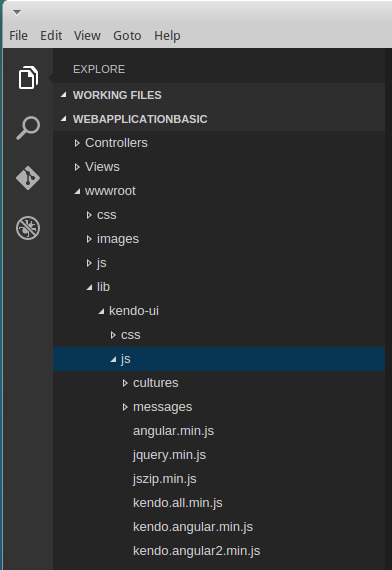

# Using Telerik UI for ASP.NET MVC in MVC 6 applications on Linux

This tutorial shows how to configure an ASP.NET MVC6 project that enables you to use Telerik UI for ASP.NET MVC on Linux.

> **Important**  
> The following steps are tested on Ubuntu 14.04.

## Prerequisites 

Make sure you have the [Microsoft ASP.NET (Beta8)](http://docs.asp.net/en/latest/getting-started/installing-on-linux.html) installed.

## Create an ASP.NET MVC 6 Website

Please skip this step if you are configuring an existing project. We will use [Yeoman](http://yeoman.io/) to scaffold an empty ASP.NET application. 

**Step 1.** Install [Node.js](https://github.com/nodesource/distributions) v.4.x (if not yet installed):
        
        curl -sL https://deb.nodesource.com/setup_4.x | sudo -E bash -
        sudo apt-get install -y nodejs

**Step 2.** Check if the Node.js version is the desired one:
        
        kendo@kendo-docker:~$ nodejs -v
        v4.2.2

**Step 3.** Install Yeoman and an [aspnet](https://github.com/omnisharp/generator-aspnet#readme) generator:

        sudo npm install -g yo generator-aspnet

**Step 4.** Navigate to the folder where you want to create the project folder using Terminal:

        kendo@kendo-docker:~$ mkdir Projects$
        kendo@kendo-docker:~$ cd Projects/
        kendo@kendo-docker:~/Projects$
        
**Step 5.** Type the following command:

        yo aspnet
   
**Result:** Now you are able to see the following response:

        kendo@kendo-docker:~/Projects$ yo aspnet

             _-----_
            |       |    .--------------------------.
            |--(o)--|    |      Welcome to the      |
           `---------´   |   marvellous ASP.NET 5   |
            ( _´U`_ )    |        generator!        |
            /___A___\    '--------------------------'
             |  ~  |     
           __'.___.'__   
         ´   `  |° ´ Y ` 
        
        ? What type of application do you want to create? 
          Empty Application 
          Console Application 
          Web Application 
        ❯ Web Application Basic [without Membership and Authorization] 
          Web API Application 
          Nancy ASP.NET Application 
          Class Library 
          Unit test project 

        
**Step 6.** Navigate using the keyboard arrow keys to select the **Web Application Basic** option, and press `Enter`. Then create the name of the new application (you can skip this step and use the default name by pressing `Enter`). After setting the name, the generator will create the desired folder and the selected application. 

**Result:** Now you are able to see the following response:

        Your project is now created, you can use the following commands to get going
            cd "WebApplicationBasic"
            dnu restore
            dnu build (optional, build will also happen when it's run)
            dnx web
        
**Step 7.** As stated in the above response, navigate to the created folder and execute the following command:

        dnu restore
        
**Result:** After typing the command above, the packages is downloaded from nuget. The end of the response looks like the following:

        Restore complete, 10070ms elapsed
        
        Feeds used:
            https://api.nuget.org/v3-flatcontainer/
        kendo@kendo-docker:~/Projects/WebApplicationBasic$ 
        
**Step 8.** Start the application using the following command:

        dnx web
        
**Result:** This delivers the following response:

        Hosting environment: Production
        Now listening on: http://localhost:5000
        Application started. Press Ctrl+C to shut down.

**Step 9.** Finally, use your favorite browser to navigate to the above location and make sure the application is working in the way shown below. After checking the application in the browser, stop the server.

## Add Kendo UI MVC NuGet Package

**Step 1.** Open the `project.json` file, using your favorite text editor, and add the `Kendo.Mvc` dependency:

        "dependencies": {
            ...
            "Kendo.Mvc": "2015.3.1026"
        }

**Step 2.** Navigate to the project folder and restore the packages again:

        dnu restore

**Step 3.** Open `Startup.cs`, using your favorite text editor (IDE), and locate the `ConfigureServices` method. Add the following snippet:

        // Register UI for ASP.NET MVC helpers
        services.AddKendo();

**Step 4.** Import the `Kendo.Mvc.UI` namespace in `~/Views/_ViewImports.cshtml`:

        @using Kendo.Mvc.UI

**Step 5.** Copy the Kendo UI client-side resources.

* Install manually by copying the `js` and `styles` folders from the `telerik.ui.for.aspnetmvc` archive to `wwwroot\lib\kendo-ui`:

* [Install Kendo UI Professional as a Bower package](/install/bower#install-kendo-ui-professional-bower-package)

**Step 6.** Register Kendo UI styles and scripts in `~/Views/Shared/Layout.cshtml`:

        <head>
        ...

        <link rel="stylesheet" href="~/lib/kendo-ui/styles/kendo.common-bootstrap.min.css" />
        <link rel="stylesheet" href="~/lib/kendo-ui/styles/kendo.bootstrap.min.css" />
        <link rel="stylesheet" href="~/lib/kendo-ui/styles/kendo.dataviz.bootstrap.min.css" />
        </head>
        <body>
        ...

        
        

        @RenderSection("scripts", required: false)
        </body>

**Step 7.** Use a Kendo UI widget, such as the DatePicker in the example below, by adding the following snippet to `~/Views/Home/Index.cshtml`:

        <h2>Kendo UI DatePicker</h2>

        @(Html.Kendo().DatePicker()
                .Name("datepicker")
                .Deferred()
        )

        @section scripts {
            @Html.Kendo().DeferredScripts()
        }

**Step 8.** Navigate to the project folder using Terminal and run it using the following command:
 
        dnx web

**Result:** All done

