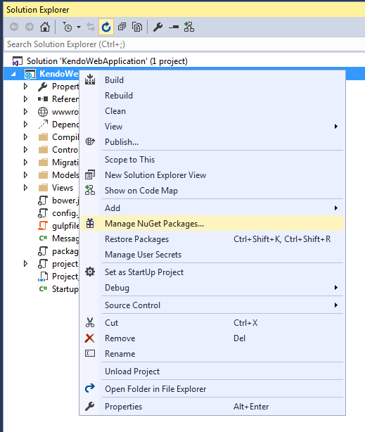

# Using Telerik UI for ASP.NET MVC in MVC 6 applications

This tutorial shows how to configure an ASP.NET MVC6 project to use Telerik UI for ASP.NET MVC.

### Prerequisites
1. [Visual Studio 2015](https://www.visualstudio.com/en-us/downloads/download-visual-studio-vs.aspx)
1. [Microsoft ASP.NET and Web Tools 2015 (Beta7)](http://www.microsoft.com/en-us/download/details.aspx?id=48738)

### 1. Create an ASP.NET MVC 6 Web Site
Please skip this step if you're configuring an existing project.

1. Select `File -> New Project`
1. Choose `Templates / Visual C# / Web / ASP.NET Web Application`
1. Set a name and location for the project
1. From the project templates select `ASP.NET 5 Preview Templates / Web Site`
1. Hit OK to create the project.

### 2. Add NuGet package

1. Open the NuGet Package Manager

    
1. Choose `api.nuget.org` as a package source and search for `Kendo.Mvc`
1. Install the `Kendo.Mvc` package version 2015.2.909 or later.
This should add a similar line in your `project.json`:

        "dependencies": {
            ...
            "Kendo.Mvc": "2015.2.909"
        }

1. Open `Startup.cs` and locate the `ConfigureServices` method. Add the following snippet:

        // Register UI for ASP.NET MVC helpers
        services.AddKendo();

1. Import the `Kendo.Mvc.UI` namespace in `~/Views/_ViewImports.cshtml`

        @using Kendo.Mvc.UI

1. Copy the Kendo UI client-side resources
    1. Manual installation

        Copy the `js` and `styles` folders from the `telerik.ui.for.aspnetmvc` archive to `wwwroot\lib\kendo-ui`

        

    1. [Install Kendo UI Professional as a Bower package](/install/bower#install-kendo-ui-professional-bower-package)

1. Register the Kendo UI styles and scripts in `~/Views/Shared/Layout.cshtml`

        <head>
        ...

        <link rel="stylesheet" href="~/lib/kendo-ui/styles/kendo.common-bootstrap.min.css" />
        <link rel="stylesheet" href="~/lib/kendo-ui/styles/kendo.bootstrap.min.css" />
        <link rel="stylesheet" href="~/lib/kendo-ui/styles/kendo.dataviz.bootstrap.min.css" />
        </head>
        <body>
        ...

        
        

        @RenderSection("scripts", required: false)
        </body>

1. Use a Kendo UI Widget

    Add the following snippet to `~/Views/Home/Index.cshtml`

            <h2>Kendo UI DatePicker</h2>

            @(Html.Kendo().DatePicker()
                    .Name("datepicker")
                    .Deferred()
            )

            @section scripts {
                @Html.Kendo().DeferredScripts()
            }

1. All done

    
