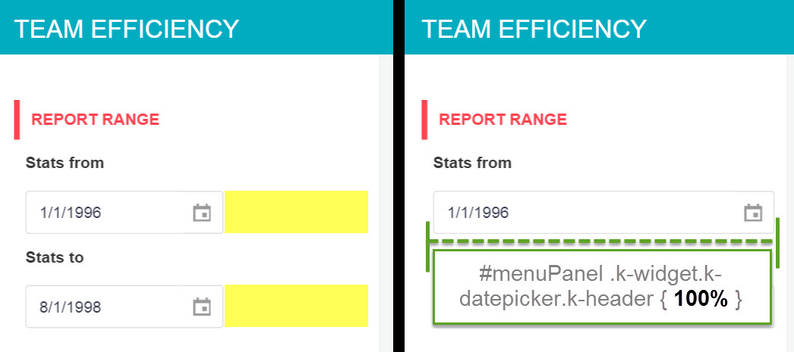
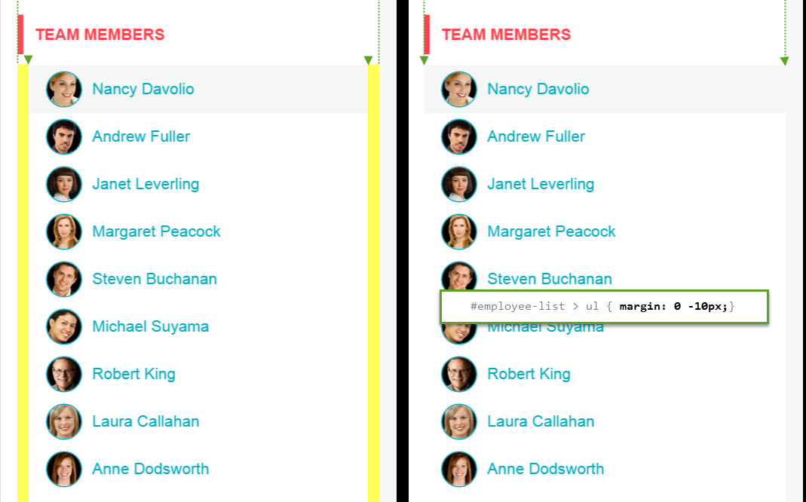
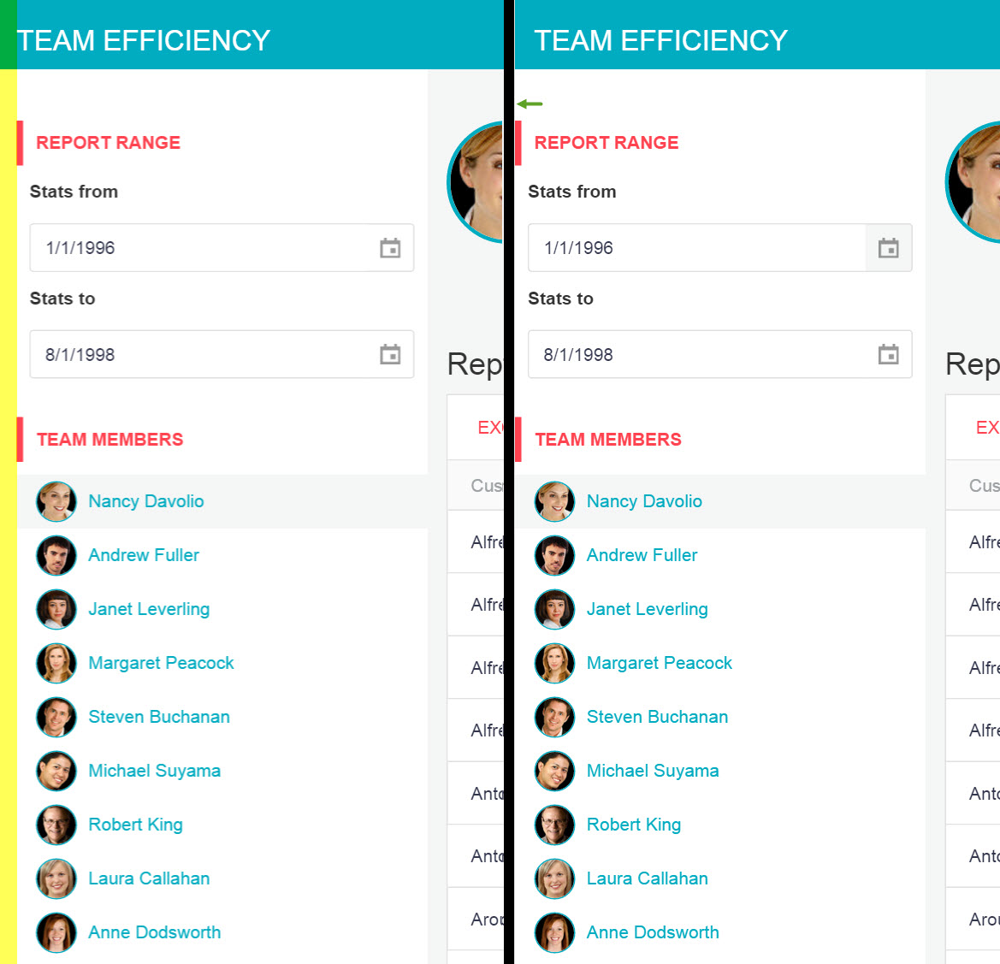

# Kendo UI Themes

Kendo UI widgets include a number of predefined themes. In this chapter you'll learn how to make your app look amazing using Kendo UI themes.

## Theme Change

### Exercise: Theme the Application

**Step 1** If running, stop the project.

**Step 2** In the Visual Studio's Project Explorer, right-click the project and choose **Telerik UI For MVC** > **Configure Project** from the menu.

**Step 3** From the Project Configuration Wizard, choose the Nova theme.

**Step 4** Open `Views/Shared/_Layout.cshtml` and move `@Styles.Render("~/Content/css")` just above the closing head tag `</head>`.

**Step 5** Run the application to see the theme applied to the Kendo UI widgets.

**Step 6** Next, you'll be finishing the theme by adding styles to non-Kendo UI elements creating a completely custom look. A style sheet was installed with the boilerplate to give you a jump-start. Add it to the application by opening `Views/Shared/_Layout.cshtml` and adding a reference to `~/Content/site-nova.css` just above the closing head tag `</head>`.

> **Note**
>
> This is CSS, so the order in which the style sheets are added is very important.

###### Example

    <link href="~/Content/site-nova.css" rel="stylesheet" />
	</head>

**Step 7** Refresh the application and notice the look is starting to come together. There's just a few items that could use some fine-tuning. Let's add some additional styles to `site-nova.css` to complete the theme.

**Step 8** Open `site-nova.css` and find the `/* Side Panel - Employee List */`. Add a style that sets the date picker widgets inside the `menuPanel` to 100% width of the container.

The resulting code should be like the one shown in the example below.

###### Example

	/* Side Panel - Employee List */
	#menuPanel .k-widget.k-datepicker.k-header {
	    width: 100%;
	}
<!--*-->

**Step 9** Add a style to offset the employee list so its content lines up with the left edge of its container.

###### Example

	#employee-list > ul {
    	margin: 0 -10px;
	}

**Step 10** Find `/* Small Devices, Tablets, and Up */`. Here you'll find a media query that will hold some styles that are only applied to scree sizes above `768px`.

###### Example

	@media only screen and (min-width : 768px) {

	}

**Step 11** Inside the media query, add a selector for `.app-wrapper` and set a left margin of `-15` and set the `position` to `relative`. This style will align the app with the left hand edge of the screen.

###### Example

	/* Small Devices, Tablets, and Up */
	@media only screen and (min-width : 768px) {
	    .app-wrapper {
	        position: relative;
	        margin-left: -15px;
	    }
	}

<!--*-->

**Step 12** Finally, set the Kendo UI Chart themes. Open `_MontlySalesByEmployee.cshtml` and set the `Theme` property to `nova` on the `EmployeeAverageSales` chart.

###### Example

	@(Html.Kendo().Chart<KendoQsBoilerplate.MonthlySalesByEmployeeViewModel>()
        .Name("EmployeeAverageSales")
        ...
        .AutoBind(false)
       	.Events(e => e.DataBound("onAverageSalesDataBound"))
        .Theme("nova")
	)

**Step 13** Open `_QuarterToDateSales.cshtml` and set the `Theme` property to `nova` on the `EmployeeQuarterSales` chart.

###### Example

    @(Html.Kendo().Chart<KendoQsBoilerplate.QuarterToDateSalesViewModel>()
        .Name("EmployeeQuarterSales")
        ...
	    .AutoBind(false)
        .Events(e => e.DataBound("onQuarterSalesDataBound"))
        .Theme("nova")
	)

And... that's it! You've created an interactive dashboard application using Telerik UI for MVC and Kendo UI. In the process you've mastered scaffolding, Kendo UI templates, charts, server and client-side APIs, responsive web design and themes.

Congratulations!

## Next Steps

Your journey with Telerik is just beginning. Here are some resources to help you figure out where to go from here.

- Follow [@telerik](https://twitter.com/telerik) on Twitter for the latest and greatest news about Telerik UIs.
- Check out the [Telerik UI for ASP.NET MVC roadmap](http://www.telerik.com/support/whats-new/aspnet-mvc) to see what's coming next.
- Find comprehensive [demos of individual widgets and complete applications](http://demos.telerik.com/aspnet-mvc/).

## See Also

Other UI for ASP.NET MVC Quick Start Guide chapters on how to build the Team Efficiency Dashboard application:

* [Getting Up and Running]()
* [Input Controls]()
* [Scaffolding]()
* [Add and Configure the Kendo UI Grid]()
* [Add and Configure the Kendo UI ListView]()
* [Manage the Client Side]()
* [Handle the Kendo UI Datasource]()
* [Add and Configure the Kendo UI Charts]()
* [Make the Application Responsive]()
