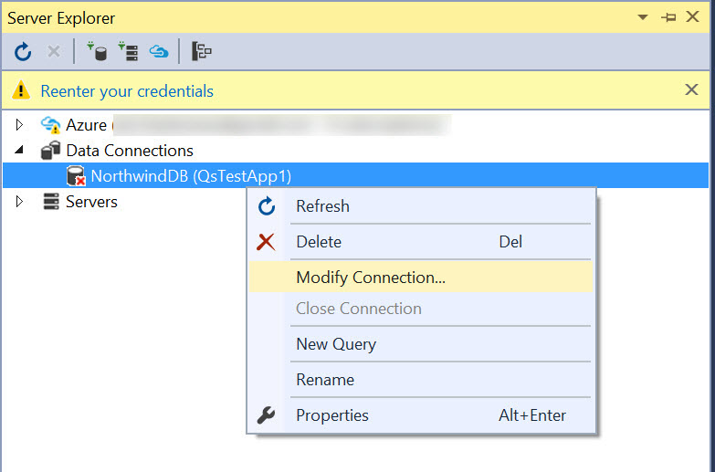
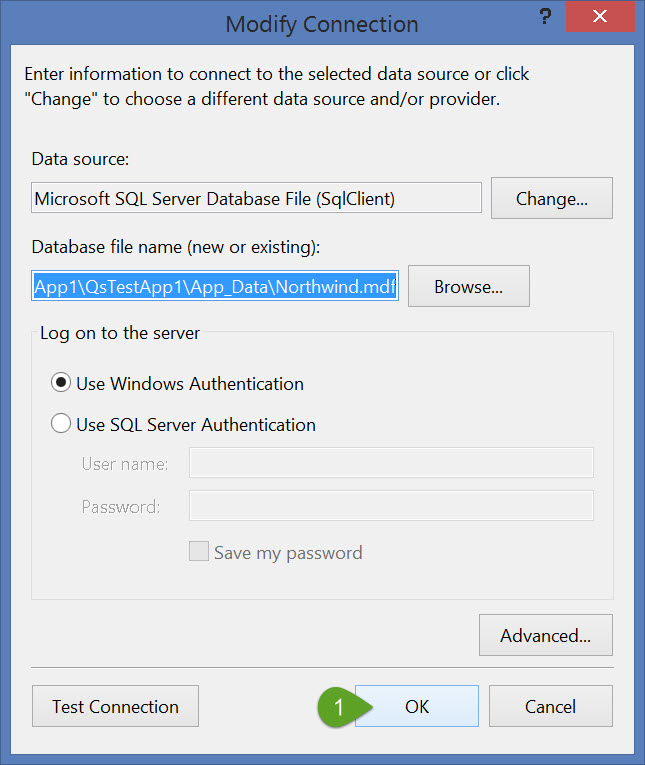
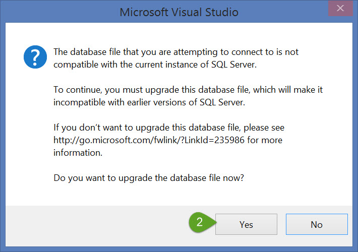
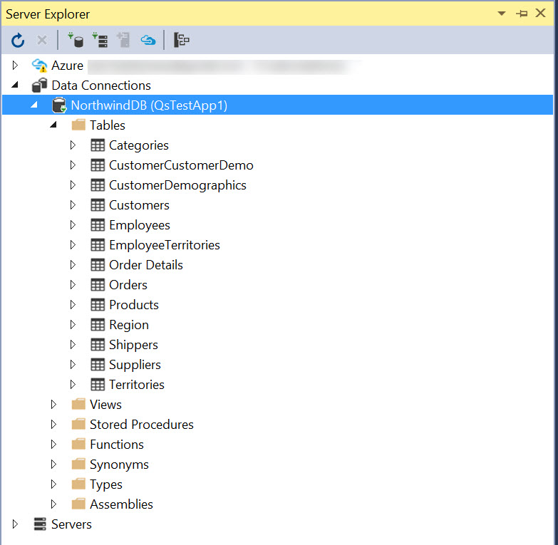
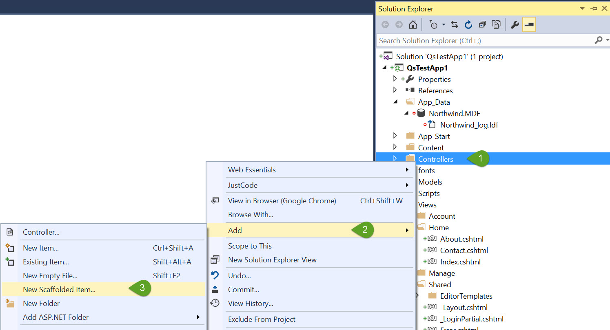
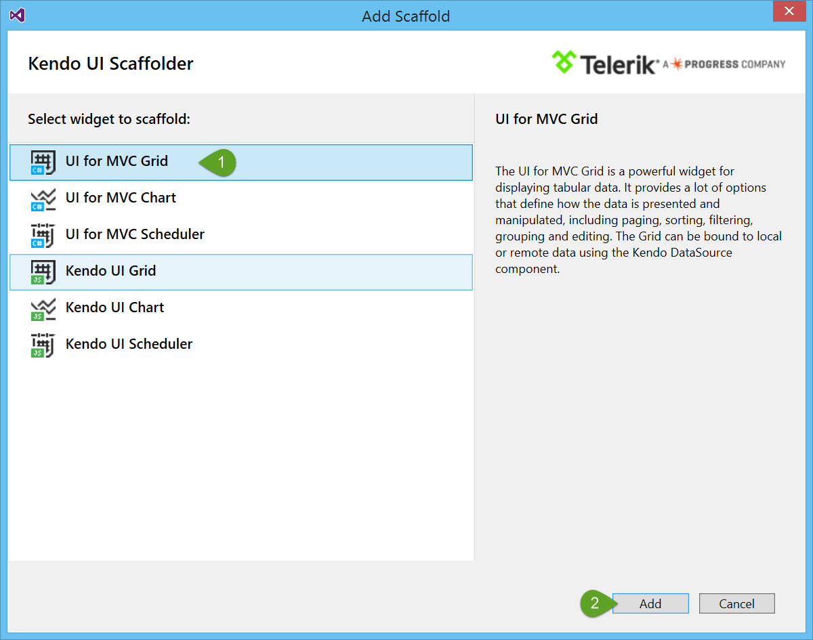
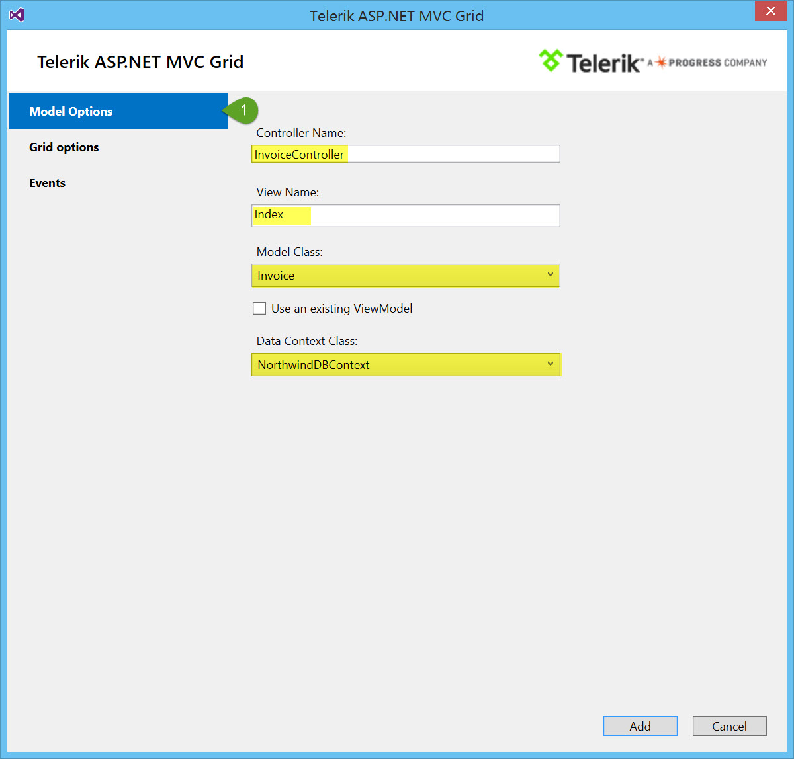
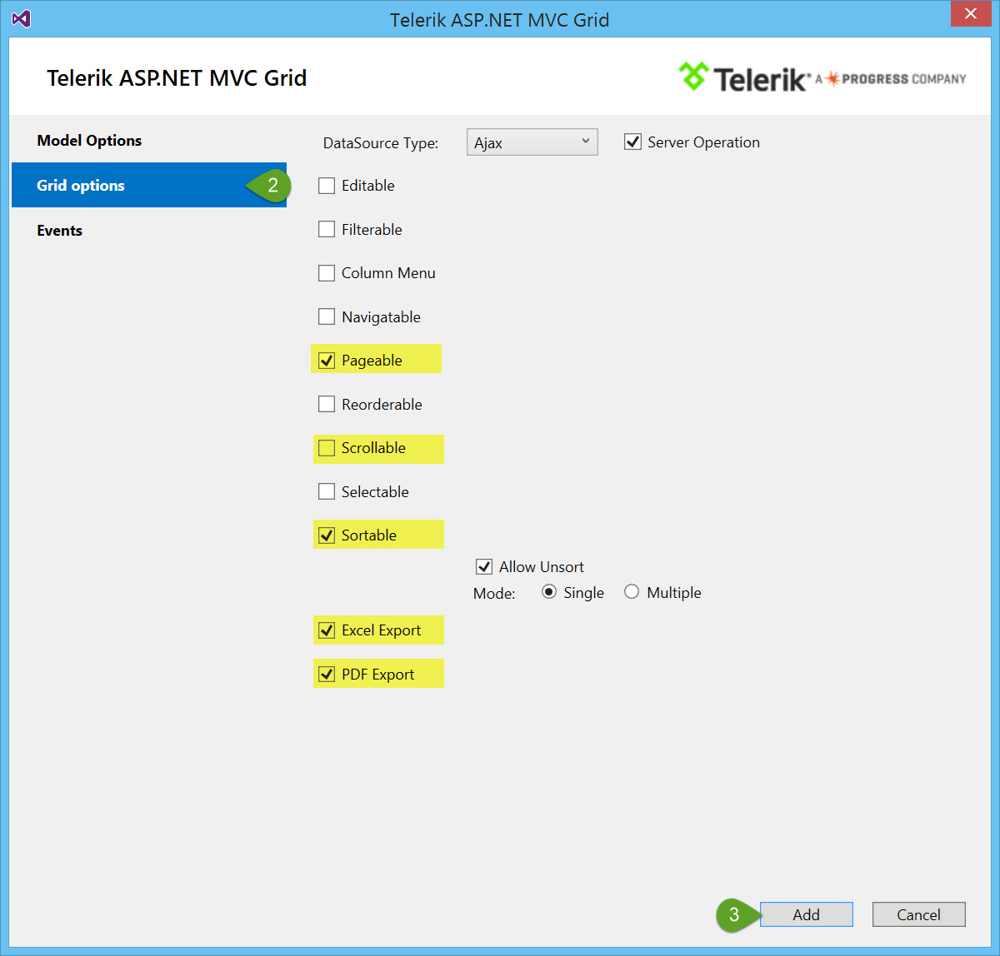
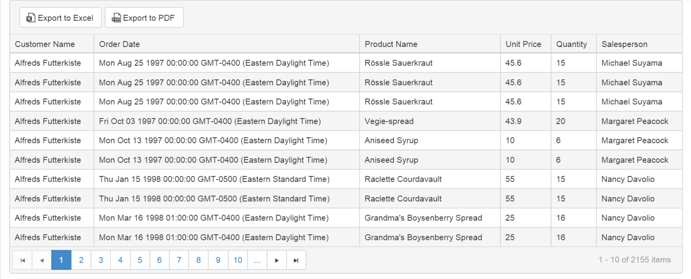

# Scaffolding

In this chapter, you'll learn how to add leverage Telerik UI for ASP.NET MVC scaffolding capabilities. One feature that MVC developers are quite used to is scaffolding. Visual-Studio-powered MVC scaffolding is a code generation framework that allows you to hook up your model to a controller and render views that are strongly typed, among other things. Since the scaffolding is simply a code generation tool, you are free to change any of the code that it generated.

## Upgrade the Database

### Overview

A copy of the Northwind database is included in the Kendo UI Quick Start Boilerplate. Before you begin scaffolding, make sure the Northwind database is upgraded. Having a working connection to the database is needed for the scaffolding wizard to work properly.

> **Note**
>
> Upgrading the database is only necessary for this guide because the database supplied must support multiple versions of SQL. Therefore, we chose the lowest database version possible.

### Exercise: Upgrade the Northwind Database

> **Note**
>
> If you do not have an SQL Server instance installed on your machine, you may need to install the SQL Server Express Edition from Microsoft. You can download the free installer [here](http://www.microsoft.com/en-us/server-cloud/products/sql-server-editions/sql-server-express.aspx).

**Step 1** Using Visual Studio's **Server Explorer**, expand **DataConnections**, and right-click **NorthwindDB** > **Modify Connection**.

**Step 2** Next, click **OK**.

**Step 3** Finally, click **Yes** to complete the upgrade.

**Step 4** Once the upgrade is complete, expand the Northwind Database Tables to verify connectivity.

With the database upgraded, use the scaffolding wizard to create an interactive grid view.

## UI for MVC Scaffolding Wizard

### Overview

The scaffolding wizard will aid you in creating the view by providing point-and-click configuration screen. Use the scaffolding wizard to create an interactive Kendo UI Grid view of invoices for the Team Efficiency Dashboard. By enabling grid features such as sorting, paging, and exporting, users will be able to analyze and share data in a familiar way.

### Exercise: Scaffold a Grid View of Invoices

**Step 1** Start the scaffolding wizard by right-clicking **Controllers** > **Add** > **New Scaffolded Item**.

**Step 2** Choose **Kendo UI Scaffolder** and click **Add** to continue.

**Step 3** Notice that the Scaffolder is capable of creating Grid, Chart, and Scheduler views for both C# and JavaScript. For this guide you'll be using the UI for MVC Grid scaffolding option. Choose **UI for MVC Grid** and click **Add** to continue.

**Step 4** From the **UI for MVC Grid** scaffolding dialog, the Grid's model options, Grid options and events are defined. The Model Options control the following settings:

- **Controller Name**&mdash;The name of the controller created by the Scaffolder.
- **View Name**&mdash;The name of the created view, which will display the scaffolded grid.
- **Model Class**&mdash;The model the Scaffolder which will be used to build the view.
- **Data Context Class**&mdash;The Entity Framework DbContext used to connect the view to the data.

**Step 5** Define the Grid's model options using the following values:

- **Controller Name**: **InvoiceController**
- **View Name**: **Index**
- **Model Class**: **Invoice**
- **Data Context Class**: **NorthwindDBContext**

The Grid options control which features are scaffolded and enabled on the Grid, including:

- `DataSource` Type&mdash;`Ajax`, `Server`, or `WebApi`.
- `Editable`&mdash;Enable the editing, configure the edit mode (`InLine`, `InCell` or `PopUp`) and the operations to be included (`Create`, `Update`, `Destroy`).
- `Filterable`&mdash;Enable the filtering of the Grid and select the filter mode.
- `Column Menu`&mdash;Enable the column menu.
- `Navigatable`&mdash;Enable the keyboard navigation.
- `Pageable`&mdash;Enable the paging of the Grid.
- `Reorderable`&mdash;Enable the column reordering.
- `Scrollable`&mdash;Enable the scrolling of the Grid table.
- `Selectable`&mdash;Enable the selection and specify the selection mode and type.
- `Sortable`&mdash;Enable the sorting and specify the sorting mode.
- `Excel Export`&mdash;Enable the Excel export functionality.
- `PDF Export`&mdash;Enable the PDF export functionality.

**Step 6** Define the Grid's options by setting the following values:

- `unchecked` Scrollable
- `checked` Sortable
- `checked` Pageable
- `checked` Excel Export
- `checked` PDF Export

**Step 7** Click **Add** to continue and create the scaffolded items.

The Scaffolder will create the following files:

- `Controllers/InvoiceController.cs`&mdash;This controller has the actions for the features selected in the scaffolding wizard.
    - `Index`&mdash;Returns the view.
    - `Invoices_Read`&mdash;Gets all invoices from the database and returns a JSON formatted `DataSourceRequest` object. The `DataSourceRequest` will contain the current grid request information (page, sort, group, and filter).
    - `Excel_Export_Save`&mdash;Creates an XLS exported File result.
    - `Pdf_Export_Save`&mdash;Creates a PDF exported File result.
- `Views/Invoice/Index.cshtml`&mdash;This view contains the markup and HTML helper responsible for rendering the Grid control.

**Step 8** Run the application and navigate to `/Invoice/index` to see the generated Grid control. You should see the following output.

Now that the UI for MVC Scaffolder has generated a starting point for working with the Grid, you can modify the scaffolded code to meet your needs. In the next chapter we'll do just that.

## See Also

Other UI for ASP.NET MVC Quick Start Guide chapters on how to build the Team Efficiency Dashboard application:

* [Getting Up and Running]()
* [Input Controls]()
* [Add and Configure the Kendo UI Grid]()
* [Add and Configure the Kendo UI ListView]()
* [Manage the Client Side]()
* [Handle the Kendo UI Datasource]()
* [Add and Configure the Kendo UI Charts]()
* [Make the Application Responsive]()
* [Add and Configure the Kendo UI Themes]()
