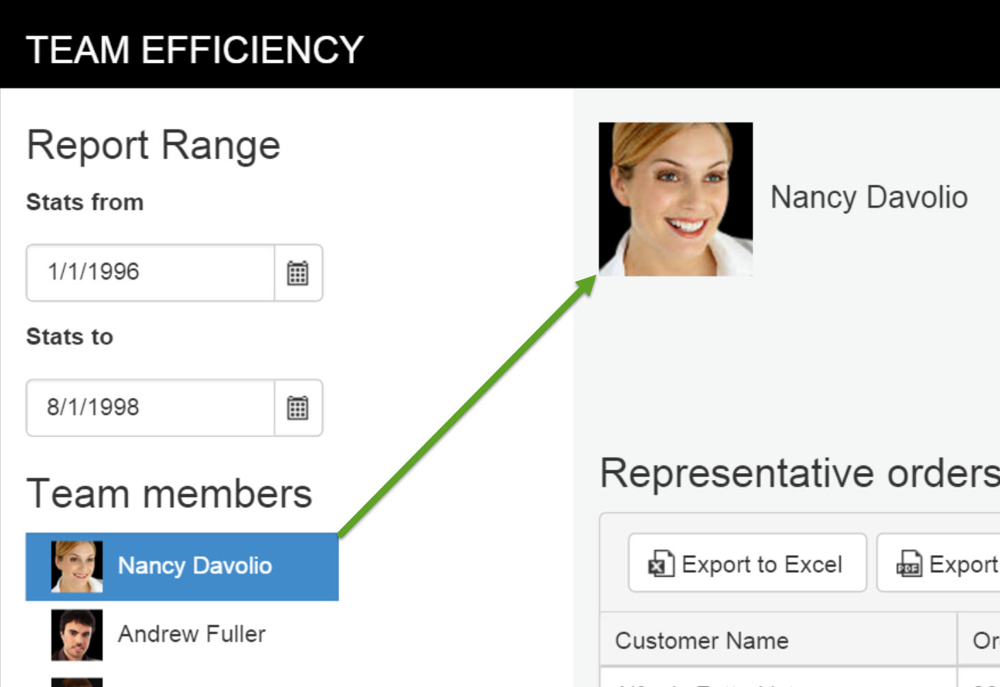

# Client Side

The client side is where Kendo UI really shines. Kendo UI uses a common JavaScript language and standards so that it’s easy for any JavaScript developer to get started. In this chapter you'll learn about client-side events and how to take control of Kendo UI using JavaScript.

## Working with Client-Side Events

### Overview

Telerik UI for MVC helpers provide an Events method that is part of the HTML Helper's property chain. The `events` method is used to set event handlers for the Kendo UI widget. Each widget has a variety of events that can be handled including: `cancel`, `change`, `dataBound`, `dataBinding`, `edit`, `remove`, and `save`.

###### Example

    @(Html.Kendo().ListView<ProductViewModel>()
            .Name("listView")
            .TagName("div")
            .ClientTemplateId("template")
            .DataSource(dataSource => {
                dataSource.Read(read => read.Action("Products_Read", "ListView"));
            })
            .Events(e => e
                .DataBound("productListView_dataBound")
                .Change("productListView_change")
            )
    )

Let's continue to work with the `EmployeesList` that was created in the previous chapter. The list is selectable, but when the application starts the first item should be selected by default giving the user a starting point to begin interacting with the dashboard.

### Exercise: Select the First List Item by Default

**Step 1** Find the `EmployeeList`.

###### Example

	<!-- Employee List View -->
	@(Html.Kendo().ListView<Employee>()
            .Name("EmployeesList")
			...
        	.Selectable(s => s.Mode(ListViewSelectionMode.Single))
	)

**Step 2** Add an event handler named `onListDataBound` for the `DataBound` event for the EmployeeList.

###### Example

	@(Html.Kendo().ListView<KendoQsBoilerplate.Employee>()
		...
		.Selectable(s => s.Mode(ListViewSelectionMode.Single))
		.Events(e => e.DataBound("onListDataBound"))
	)

The resulting code should be like the one shown below.

###### Example

	<!-- Employee List View -->
	@(Html.Kendo().ListView<KendoQsBoilerplate.Employee>()
    	.Name("EmployeesList")
        .ClientTemplateId("EmployeeItemTemplate")
        .TagName("ul")
        .DataSource(dataSource =>
        {
        	dataSource.Read(read => read.Action("EmployeesList_Read", "Home"));
        	dataSource.PageSize(9);
		})
        	.Selectable(s => s.Mode(ListViewSelectionMode.Single))
            .Events(e => e.DataBound("onListDataBound"))
	)

**Step 3** In the same view, find the `Scripts` section.

###### Example

	@section Scripts {
	    
	}

**Step 4** In the `
	}

**Step 6** Refresh the page to see that the first item in the list is selected by default.

Selecting the first item using the `DataBound` event was a good start. Next we'll take it a step further by using the selected item to populate a Kendo UI template showing the selected employee on the dashboard.

### Exercise: Use the Change Event to Populate Templates

**Step 1** Add an event handler named `onCriteriaChange` for the `Change` event for the `EmployeeList`.

###### Example

	@(Html.Kendo().ListView<Employee>()
			...
        	.Selectable(s => s.Mode(ListViewSelectionMode.Single))
            .Events(e => e.DataBound("onListDataBound")
   					      .Change("onCriteriaChange"))
	)

**Step 2** Find the `<!-- Kendo Templates -->` placeholder.

###### Example

	<!-- Kendo Templates -->
		...
	<!-- /Kendo Templates -->

**Step 3** Add a new template that will display the selected employee's image and full name.

###### Example

	<!-- Kendo Templates -->
	

**Step 4** Find the `

**Step 5** Add a function named `getSelectedEmployee` that returns the selected employee from the `EmployeeList`.

###### Example

	function getSelectedEmployee() {
    	var employeeList = $("#EmployeesList").data("kendoListView"),
		employee = employeeList.dataSource.getByUid(employeeList.select().attr("data-uid"));
		return employee;
	}

**Step 6** Add a function named `updateEmployeeAvatar` that binds the selected employee data to the `employeeAvatarTemplate` and places the template's content in the `employee-about` element.

###### Example

	function updateEmployeeAvatar() {
        var employee = getSelectedEmployee(),
            template = kendo.template($("#employeeAvatarTemplate").html());

        //apply template
        $("#employee-about").html(template(employee));
    }

**Step 7** Add a function named `onCriteriaChange`. This function will handle the `Change` event and call `updateEmployeeAvatar`.

###### Example

	function onCriteriaChange() {
        updateEmployeeAvatar();
	}

**Step 8** Refresh the page and select an employee from the `EmployeeList`. Selecting an item should update the dashboard with the selected employee's data.

**Step 9** Find and remove the `<!-- Employee Avatar -->` placeholder code, it is no longer needed because the element is created dynamically. Remove the code shown in the example below.

###### Example

     <!-- Employee Avatar -->
     @Html.Placehold(90, 90, "Face")
     Full Name 

Now that you know how to work with client-side APIs, let's enhance the Team Efficiency Dashboard by working with datasources.

## See Also

Other UI for ASP.NET MVC Quick Start Guide chapters on how to build the Team Efficiency Dashboard application:

* [Getting Up and Running]()
* [Input Controls]()
* [Scaffolding]()
* [Add and Configure the Kendo UI Grid]()
* [Add and Configure the Kendo UI ListView]()
* [Handle the Kendo UI Datasource]()
* [Add and Configure the Kendo UI Charts]()
* [Make the Application Responsive]()
* [Add and Configure the Kendo UI Themes]()
