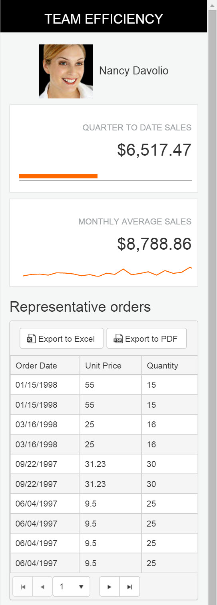
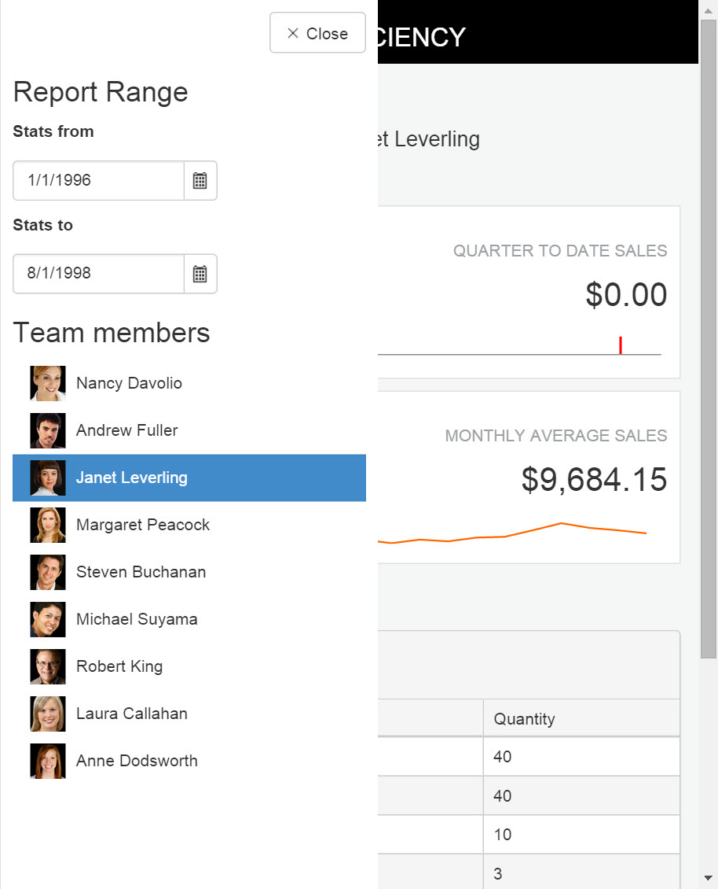

# Go Responsive

In this chapter you'll learn how to make the dashboard application look amazing on any device size. The Team Efficiency Dashboard layout uses Bootstrap for some basic responsive functionality. However, more detailed controls, such as the Grid, need extra attention to ensure a proper user experience on any device size. In the next few steps you'll take the app from desktop, to anywhere, with a few key changes.

## Responsive Grid

### Overview

Run the project and shrink the browser window horizontally to about 400 pixels wide. Refresh the browser and observe how the application elements stack nicely, but the grid bleeds off the page. There is simply too much information in the grid to show at this screen size. By setting a few properties we can remove non-essential columns from the grid for small screens.

### Exercise: Make the Grid Mobile Friendly with Responsive APIs

**Step 1** Open `Views/Invoice/Index.cshtml` and find where the `Columns` are defined in the `EmployeeSales` grid.

###### Example

	.Columns(columns =>
    {
        ...
    })

Remove the `Salesperson` column completely. The sales person is already displayed at the top of the page.

**Step 2** Set the `MinScreenWidth` of the `CustomerName` column to `900`. This means that the column will no longer be displayed on screen sizes less than 900 pixels wide.

**Step 3** Set the `MinScreenWidth` of the `ProductName` column to `768`. This means that the column will no longer be displayed on screen sizes less than 768 pixels wide.

###### Example

	.Columns(columns =>
    {
        columns.Bound(c => c.CustomerName).MinScreenWidth(900);
        columns.Bound(c => c.OrderDate).Format("{0:MM/dd/yyyy}");
        columns.Bound(c => c.ProductName).MinScreenWidth(768);
        columns.Bound(c => c.UnitPrice);
        columns.Bound(c => c.Quantity);
    })

**Step 4** Refresh the page, then shrink and grow the browser to different widths to see how the grid reacts at various sizes.

## Responsive Panel

### Overview

When changing the screen size, you may have noticed the Report Range side bar disappear. If not, take a moment to adjust the browser width again to see the side bar's behavior. Currently, the sidebar is hidden using the [Bootstrap's `hidden-xs` class](http://getbootstrap.com/css/#responsive-utilities). Bring back the side bar using a Kendo UI ResponsivePanel and make a seamless user experience on any device size.

### Exercise: Add a Responsive Panel Side Bar

**Step 1** Open `Views/Home/Index.cshtml` and find the `<!-- Menu Panel -->` placeholder. Below the `<!-- Menu Panel -->` placeholder add a `ResponsivePanel`. Set the `Name` to `menuPanel` and set the Breakpoint to `768`.

**Step 2** Add a `Content` property and include all of the elements until you reach the ending `<!-- /Menu Panel -->` placeholder.

> **Note**
>
> The `at` symbol `@` is used as an escape charter for HTML content.

The resulting code should be like the one shown in the example below.

###### Example

	<!-- Menu Panel -->
	    @(Html.Kendo().ResponsivePanel().Name("menuPanel").Breakpoint(768).Content(
	    @

            ...
        

    ))
    <!-- /Menu Panel -->

**Step 3** Remove `class="hidden-xs" style="float:left;"` from the `div` element in the newly added responsive panel.

###### Example

	<!-- Menu Panel -->
	    @(Html.Kendo().ResponsivePanel().Name("menuPanel").Breakpoint(768).Content(
	    @

            ...
        

    ))
    <!-- /Menu Panel -->

**Step 4** Next, add a button for users to tap and toggle the responsive panel.

**Step 5** Find the block of code shown in the example below.

###### Example

	<section id="app-title-bar" class="row">
	    

	        <h1 class="title">@ViewBag.Title</h1>
	    

	</section>

After the section's closing tag `</section>`, add a new `div` with a `class` of `hamburger`.

**Step 6** Inside the hamburger `div`, create a Kendo UI Button. Set the following button's properties:

- `Name: menuPanelOpen`
- `Content: menu`
- `Icon: hbars`
- `HtmlAttributes: new { @class = "k-rpanel-toggle" }`

> **Note**
>
> Any element with the `k-rpanel-toggle` class will be able to toggle the current page's responsive panel.

###### Example

	

	    <!-- toggle button for responsive panel, hidden on large screens -->
	    @(Html.Kendo().Button()
	                .Name("menuPanelOpen")
	                .Content("menu")
	                .Icon("hbars")
	                .HtmlAttributes(new { @class = "k-rpanel-toggle" }
	    )
	

**Step 7** Open `Content/Site.css` and find the `/* Top Bar */` placeholder.

###### Example

	/* Top Bar */

<!--*-->
**Step 8** Add a style that selects the `hamburger` element and sets the `position` to `absolute`. Give the style a `top` of `5` and `left` of `5` to create a margin around the element.

###### Example

	.hamburger {
	    position: absolute;
	    top: 5px;
	    left: 5px;
	}

**Step 9** Add a style that selects the `menuPanel`. Set a solid background color of `#fff` (white), include a `padding` of `10px` and `z-index` of `3`. This style will ensure that the panel appears above other UI elements and has a solid background.

###### Example

	#menuPanel {
	    background-color: #fff;
	    padding: 10px;
	    z-index: 3;
	}

**Step 10** Run or refresh the application. Expand and contract the browser's width, notice the **Menu** button appear when the browser is small. Click the **Menu** button to open the panel. Click beside the panel to collapse it.   

**Step 11** For a better user experience, add a **Close** button to the panel so the interaction is discoverable and intuitive.

**Step 12** Find the `menuPanel` and add a Kendo UI Button inside the Content's first `div`. Set the following button's properties:

- `Name: menuPanelClose`
- `Content: Close`
- `Icon: close`
- `HtmlAttributes: new { @class = "k-rpanel-toggle" }``

**Step 15** Wrap the button in a `div` with a class of `text-right` to position the button on the right hand edge of the panel.

###### Example

	@(Html.Kendo().ResponsivePanel().Name("menuPanel").Breakpoint(768).Content(
    @

        

            @(Html.Kendo().Button()
               .Name("menuPanelClose")
               .Content("Close")
               .Icon("close")
               .HtmlAttributes(new { @class = "k-rpanel-toggle" })
            )
        

        ...
     

**Step 13** Refresh the application. Expand and contract the browser's width until the **Menu** button is shown. Toggle the responsive panel using the **Menu** and **Close** buttons.

The application is almost complete, just apply a nice bright theme and it will be ready to ship.

## See Also

Other UI for ASP.NET MVC Quick Start Guide chapters on how to build the Team Efficiency Dashboard application:

* [Getting Up and Running]()
* [Input Controls]()
* [Scaffolding]()
* [Add and Configure the Kendo UI Grid]()
* [Add and Configure the Kendo UI ListView]()
* [Manage the Client Side]()
* [Handle the Kendo UI Datasource]()
* [Add and Configure the Kendo UI Charts]()
* [Add and Configure the Kendo UI Themes]()
