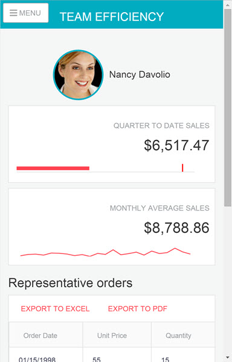

# Overview

The tutorial on how to build the Team Efficiency Dashboard application by using Telerik UI for ASP.NET MVC is contributed by Developer Advocate Ed Charbeneau.

## Introduction

Welcome to the [UI for ASP.NET MVC](http://www.telerik.com/aspnet-mvc) quick start guide. In this guided tutorial you will learn how to install, configure, and utilize UI for ASP.NET MVC to build a rich single-page dashboard application that works beautifully on any device.

### What You're Building

This guide will walk you through building Team Efficiency Dashboard, a single page app that does the following things:

- Connects rich chart visualizations and grids to an SQL data source.
- Provides an interactive master/detail dashboard with filtering, sorting and exporting.
- Looks great on any device size including: mobile, tablet and desktop.

If you follow along until the end, here is what the finished app will look like.

And here is what the app will look like on mobile.

### UI for ASP.NET MVC vs Kendo UI Widgets

From client-side point of view, the vanilla HTML/JavaScript **Kendo UI** widgets and the rendered **UI for ASP.NET MVC** represent the same thing and provide the same capabilities.
However, the UI for ASP.NET MVC wrappers provide additional capabilities for use with ASP.NET MVC and tooling for VisualStudio. Refer to the [documentation]() for a complete feature comparison.

### Important Resources

- [Documentation - UI for ASP.NET MVC]()
- [API References - UI for ASP.NET MVC](/api/aspnet-mvc/Kendo.Mvc/AggregateFunction)
- [Support](http://www.telerik.com/account/support-tickets/my-support-tickets.aspx)

## See Also

Below are listed all UI for ASP.NET MVC Quick Start Guide chapters on how to build the Team Efficiency Dashboard application:

* [Getting Up and Running]()
* [Input Controls]()
* [Scaffolding]()
* [Add and Configure the Kendo UI Grid]()
* [Add and Configure the Kendo UI ListView]()
* [Manage the Client Side]()
* [Handle the Kendo UI Datasource]()
* [Add and Configure the Kendo UI Charts]()
* [Make the Application Responsive]()
* [Add and Configure the Kendo UI Themes]()
