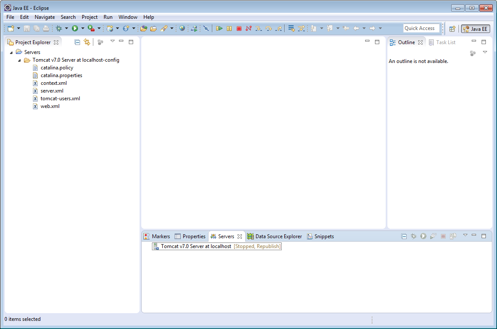
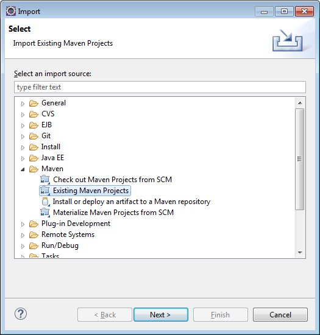
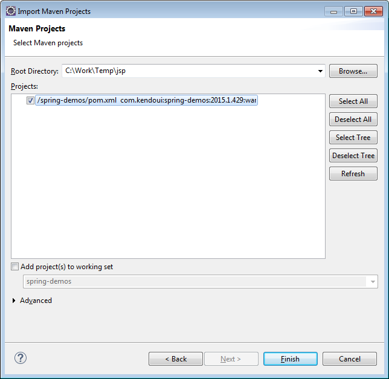
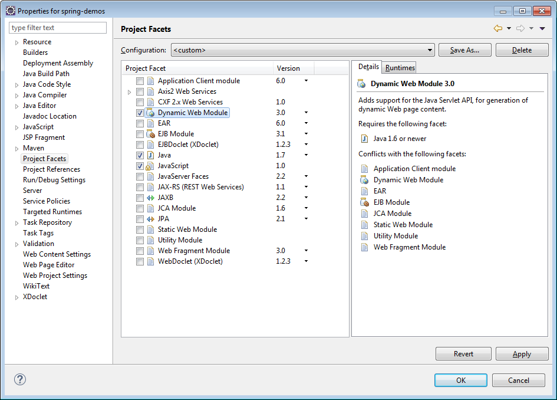
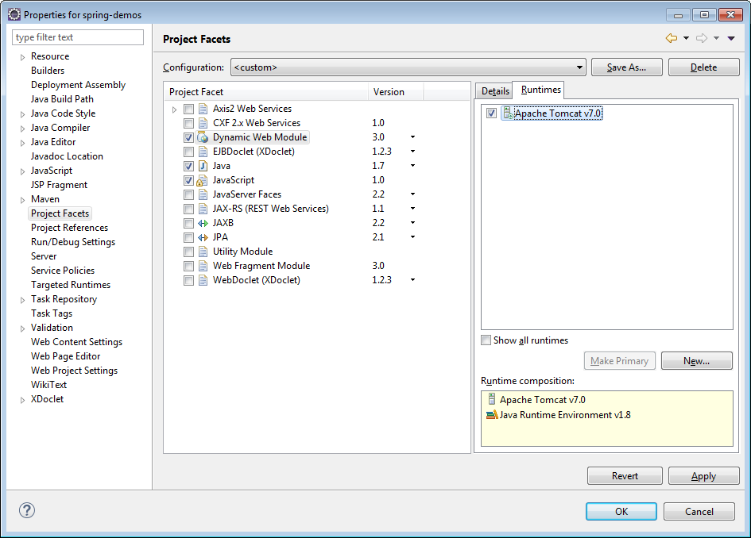

## Downloading and Installing Telerik UI for JSP

The distribution files contain the following:

*   **\js** - Kendo UI minified JavaScript files.
*   **\styles** - Kendo UI minified CSS files and background images used by the themes.
*   **\wrappers\jsp\kendo-taglib** - Telerik UI for JSP jar files.
*   **\wrappers\jsp\spring-demos** - a sample JSP Spring MVC application.

## Running the sample application

#### Requirements

*   JDK 1.8 or 1.7
*   Eclipse for Enterprise Developers (J2EE support) - Luna, Kepler or newer
*   Maven support for Eclipse - m2e
*   Configured server (tested with Tomcat 7)

You can find a sample JSP Spring MVC application in the **\wrappers\jsp\spring-demos** folder.

#### Steps to run the project

1.  Extract the Telerik UI for JSP package.
1.  Start Eclipse.
1.  Choose "File -> Import".
1.  Choose "Maven -> Existing Maven Projects". Click "Next". If you don't see that option make sure your Eclipse has Maven support installed.

    
1.  Browse to the location where you extracted Telerik UI for JSP. Then pick "wrappers\jsp\spring-demos" for "Root Directory". Click "Finish".

    
1.  Right-click "spring-demos" in Eclipse Project Explorer. Pick "Properties".
1.  In the properties window pick "Project Facets".
1.  From the "Project Facets" menu select "Dynamic Web Module".

    
1. Click the "Runtimes" tab. Pick a runtime (Tomcat 7 for example).

    
1. Press "OK" to close the "Properties" window.
1. Right-click "spring-demos" in Eclipse Project Explorer. Pick "Run As -> Run on server".

## Using Kendo UI in JSP application

1.  Create a new **"Dynamic Web Project"** from Eclipse or open an existing one.
1.  Add **\wrappers\jsp\kendo-taglib\kendo-taglib-[version].jar** to project's **/WebContent/WEB-INF/lib folder**.
1.  Copy the Kendo UI JavaScript files from the **\js** folder of the installation to the **WebContent/resources/js** folder of your application.

    If you want to use CDN skip steps 3, 4 and 5 and check the [Using CDN](#using-cdn) section.
1.  Copy the Kendo UI CSS files and folders from the **\styles** folder of the installation to the **WebContent/resources/styles** folder of your application. If you want to use only one theme copy **kendo.common.min.css**, the theme file (e.g. **kendo.default.min.css**), the theme folder (e.g. **Default**) and the **textures** folder.
1. Add a JSP page.
    *   Right-mouse click on WebContent folder
    *   Select New -> JSP file
    *   Enter file name and click Finish
1.  Configure your page to include the Kendo UI Web JavaScript and CSS files to the page:

        <link href="resources/styles/kendo.common.min.css" rel="stylesheet" type="text/css" />
        <link href="resources/styles/kendo.default.min.css" rel="stylesheet" type="text/css" />
        
        
1.  Configure your page to include the Kendo UI DataViz JavaScript and CSS files. **Important**: If you want to use Kendo UI Web and DataViz at the same time you should include **kendo.all.min.js** instead of **kendo.web.min.js** and **kendo.dataviz.min.js**. You can also create a custom JavaScript file using the [Custom Download Builder](http://www.telerik.com/download/custom-download).

        <link href="resources/styles/kendo.common.min.css" rel="stylesheet" type="text/css" />
        <link href="resources/styles/kendo.dataviz.min.css" rel="stylesheet" type="text/css" />
        <link href="resources/styles/kendo.dataviz.default.min.css" rel="stylesheet" type="text/css" />

        
        
1.  Add taglib mapping to the kendo tags

        <%@taglib prefix="kendo" uri="http://www.kendoui.com/jsp/tags"%>
1.  Use any Kendo UI HtmlHelper extension:

        <kendo:datePicker name="datePicker"></kendo:datePicker>

### Using CDN

You can include the JavaScript and CSS files from CDN. Don't forget to specify the version (e.g. 2012.2.710)

    <link href="http://kendo.cdn.telerik.com/<VERSION>/styles/kendo.common.min.css" rel="stylesheet" type="text/css" />
    <link href="http://kendo.cdn.telerik.com/<VERSION>/styles/kendo.default.min.css" rel="stylesheet" type="text/css" />

    
    

## Next Steps

You can watch the videos in the [Kendo UI YouTube channel](http://www.youtube.com/kendouitv):

1. [Getting Started With Telerik UI for JSP - Episode 1](https://www.youtube.com/watch?v=3VH75XVhLCI)
1. [Getting Started With Telerik UI for JSP - Episode 2](https://www.youtube.com/watch?v=LyGHeRMmq5I)
1. [Getting Started With Telerik UI for JSP - Episode 3](https://www.youtube.com/watch?v=sCwqj_ZRGI8)
1. [Getting Started With Telerik UI for JSP - Episode 4](https://www.youtube.com/watch?v=fcbw4YR4P2I)
